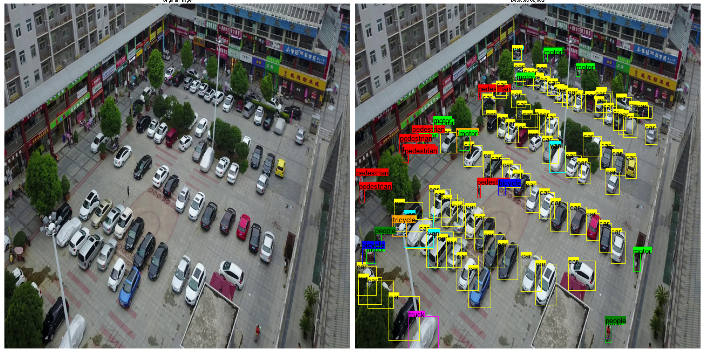
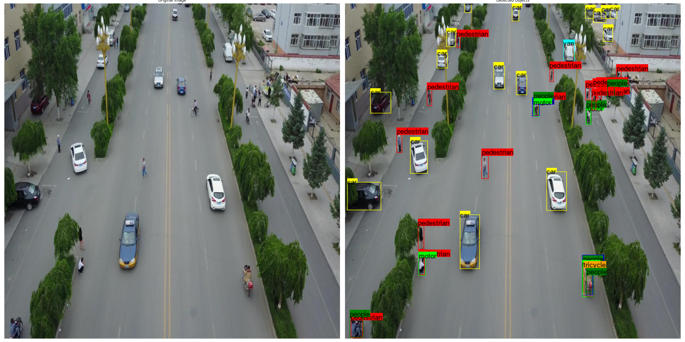
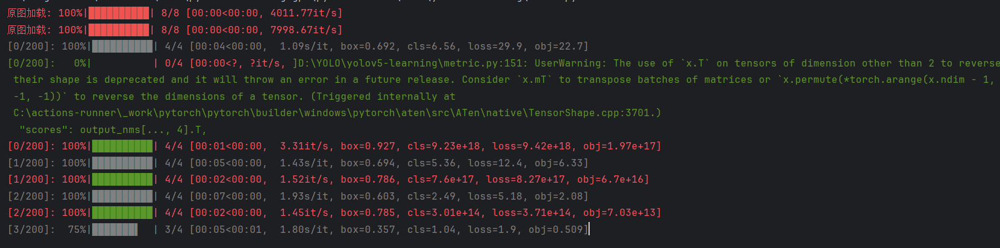
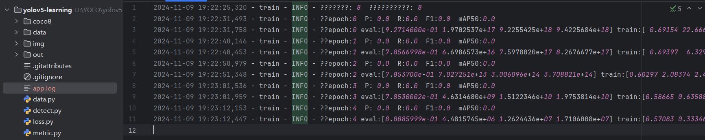
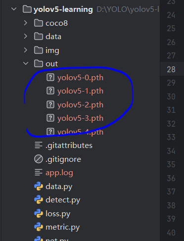

# 掌控yolov5-用最简洁的代码复现

用最简单，最少的代码(700行左右)复现官方yolov5， 帮助想要学习它，搞明白它的同学一个参考。做一个对业余人士最友好的源码教程。

> 在 Visdrone2019 tain数据集训练，在val 上验证的效果：





## 一，运行项目

### 1，下载源代码

```shell
git clone https://github.com/tianmaoyu/yolov5-learning
cd yolov5-learning
#安装依赖
pip install -r requirements.txt
```

### 2，目录介绍

- coco8目录 : coco 数据集中的前 8张图片，要来训练和验证 模型是否能学习到东西
- data目录 :  visdrone 无人机数据集几张测试图片
- data/yolov5-156.pth : 在 VisDrone 数据集中训练的156 个epoch 权重和模型文件
- data/yolov5-structure.png ： 由噼里啪啦博主手画的yolov5网络图
- out目录  : 训练过程中，每一轮保存的 yolov5-{epoch}.pth 文件（记得清理，不然磁盘就满了）
- **data.py** : 数据加载，和预处理
- **loss.py** :  loss 函数定义
- **net.py :** 网络定义
- **metric.py:** 性能指标的定义
- **detect.py:** 检测头， 使用训练好的 模型进行 预测。

### 3，detect.py 运行

>  代码加载yolov5-156.pth 模型，和一张图片进行检测； 下面是默认效果


### 4，训练 train.py

默认使用 coco8 （八张）图片进行训练和验证。



**日志**：



**注意：**记得自行清理 .pth 文件




## 二，学习

### 1. 基础

官方文档：https://pytorch.org/docs/stable/generated/torch.stack.html

stack 理解：https://blog.csdn.net/weixin_44201525/article/details/109769214

张量是多维数组的泛化，既可以是一维的向量、二维的矩阵，也可以是三维、四维甚至更高维的对象。

#### 1.1 张量的维度

- **0维张量**：标量。一个单一的数值。

  ```python
  scalar = torch.tensor(3)
  print(scalar.ndimension())  # 输出 0
  scaler.shape # 表示在维度上的长度 ()
  ```

- **1维张量**：向量。可以包含多个元素。

  ```python
  vector = torch.tensor([1, 2, 3])
  print(vector.ndimension())  # 输出 1 
  vector.shape # (3,)
  ```

- **2维张量**：矩阵。常见的图像数据通常是2维或更高维张量。

  ```python
  matrix = torch.tensor([[1, 2], [3, 4]])
  print(matrix.ndimension())  # 输出 2
  metric.shape # (2,2)
  ```

- **3维张量**：在深度学习中，图像通常以 `(channels, height, width)` 的形式表示。

  ```python
  image_3d = torch.randn(3, 28, 28)  # 3 channels, 28x28 image
  print(image_3d.ndimension())  # 输出 3
  ```

- **4维张量**：在处理批量图像时，通常是 `(batch_size, channels, height, width)` 。

  ```python
  image_batch = torch.randn(16, 3, 28, 28)  # 16 images, each with 3 channels and 28x28 size
  print(image_batch.ndimension())  # 输出 4
  ```

#### 1.2 创建张量

- `torch.randn`：生成一个随机张量，服从标准正态分布。

  ```python
  tensor_rand = torch.randn(2, 3)  # 2行3列的随机张量
  print(tensor_rand)
  ```

- `torch.arange`：生成一个等差数列。

  ```python
  tensor_arange = torch.arange(0, 10, 2)  # 从0开始，步长为2
  print(tensor_arange)
  ```

- `torch.zeros`：生成一个全零张量。

  ```python
  tensor_zeros = torch.zeros(2, 3)
  print(tensor_zeros)
  ```

------

### 2. **张量变形与操作**

#### 2.1 改变张量的索引方式：`view()`

`view()` 方法用来改变张量的形状，==不会改变数据本身==，只是返回一个新的张量。要注意，新的形状必须是原张量形状的重排，不会改变数据的顺序。

```python
x = torch.randn(4, 4)
x_reshaped = x.view(16)  # 改变形状为 1x16
print(x_reshaped)
```

#### 2.2 重新排列维度：`permute()`

`permute()` 方法可以重新排列维度的顺序，适用于需要调整维度顺序的情况，如图像数据（通常是 CHW 顺序，转为 HWC）。

```python
x = torch.randn(2, 3, 4)  # shape: (2, 3, 4)
x_permuted = x.permute(2, 0, 1)  # shape: (4, 2, 3)
print(x_permuted)
```

#### 2.3 内存排列：`contiguous()`

有时候，`permute()` 操作会导致张量的==内存布局==发生变化，使用 `contiguous()` 可以确保返回一个有着连续内存的张量。

```python
x = torch.randn(2, 3, 4)
x_permuted = x.permute(2, 0, 1)  # 改变了维度顺序
x_contiguous = x_permuted.contiguous()
print(x_contiguous.is_contiguous())  # 输出 True
```

------

### 3. **广播与维度操作**

#### 3.1 广播机制（Broadcasting）

广播是指在不同形状的张量进行运算时，PyTorch 会自动地扩展其中的某些维度，使得两个张量具有相同的形状。

```python
a = torch.tensor([1, 2, 3])
b = torch.tensor([[1], [2], [3]])
result = a + b  # 自动广播
print(result)
```

#### 3.2 维度增加与减少

- 增加维度：使用 `unsqueeze()` 来增加一个维度。

  ```python
  x = torch.tensor([1, 2, 3])
  x_unsqueezed = x.unsqueeze(0)  # 增加一个维度，变成 (1, 3)
  print(x_unsqueezed)
  ```

- 减少维度：使用 `squeeze()` 来去除长度为1的维度。

  ```python
  x = torch.tensor([[1], [2], [3]])
  x_squeezed = x.squeeze()  # 去除第一个维度
  print(x_squeezed)
  ```

------

### 4. **从 list 到 tensor，tensor 到 list**

- **list 到 tensor**：

  ```python
  my_list = [1, 2, 3]
  tensor_from_list = torch.tensor(my_list)
  print(tensor_from_list)
  ```

- **tensor 到 list**：

  ```python
  tensor_to_list = tensor_from_list.tolist()
  print(tensor_to_list)
  ```

------

### 5. **张量索引与赋值**

#### 5.1 普通索引

```python
x = torch.tensor([1, 2, 3, 4, 5])
print(x[2])  # 输出 3
```

#### 5.2 高级索引

```python
x = torch.tensor([[1, 2], [3, 4], [5, 6]])
print(x[:, 1])  # 输出第二列: tensor([2, 4, 6])
```

#### 5.3 指定索引赋值

```python
x = torch.tensor([1, 2, 3])
x[1] = 10  # 给第二个元素赋值, 如果是在 gpu 上， = torch.tensor(10)
print(x)  # 输出 tensor([ 1, 10,  3])
```

------

### 6. **张量的其他操作**

#### 6.1 `torch.min`, `torch.max`

```python
x = torch.tensor([1, 2, 3, 4])
min_value = torch.min(x)
max_value = torch.max(x)
print(min_value, max_value)  # 输出 1, 4
```

#### 6.2 `sigmoid` 函数

```python
x = torch.tensor([-1.0, 0.0, 1.0])
sigmoid_result = torch.sigmoid(x)
print(sigmoid_result)  # 输出 [0.2689, 0.5, 0.7311]
```

#### 6.3 `stack` 和 `cat`

- `stack`：将多个张量沿==新==维度连接。

  ```python
  x = torch.randn(2, 3)
  y = torch.randn(2, 3)
  stacked = torch.stack([x, y], dim=0)  # 沿第0维堆叠
  print(stacked.shape)  # 输出 torch.Size([2, 2, 3])
  ```

- `cat`：沿==现==有维度连接张量。

  ```python
  x = torch.randn(2, 3)
  y = torch.randn(2, 3)
  concatenated = torch.cat([x, y], dim=1)  # 沿第1维拼接
  print(concatenated.shape)  # 输出 torch.Size([2, 6])
  ```

------

### 7. **设备管理：Tensor 在 CPU 与 GPU 上**

张量需要在同一设备上进行计算，因此张量之间的操作要求它们在相同的设备上。

```python
x_cpu = torch.tensor([1, 2, 3])
x_gpu = x_cpu.to('cuda')  # 将张量移动到GPU
result = x_gpu + x_gpu  # 计算时两个张量在同一设备上
print(result)
```

------

### 8. **API 介绍**

#### 8.1 `torchvision.ops.nms`

`nms`（非极大值抑制）用于在目标检测中去除多余的重叠框。

```python
import torchvision.ops as ops

boxes = torch.tensor([[0, 0, 10, 10], [1, 1, 11, 11], [2, 2, 12, 12]], dtype=torch.float)
scores = torch.tensor([0.9, 0.75, 0.8])
keep = ops.nms(boxes, scores, 0.5)
print(keep)  # 输出 [0, 2]
```

#### 8.2 `torchmetrics.detection.MeanAveragePrecision`

`MeanAveragePrecision`（mAP）是衡量目标检测模型性能的重要指标。

```python
from torchmetrics.detection import MeanAveragePrecision

# 模拟一些检测框
preds = [{"boxes": torch.tensor([[0, 0, 10, 10], [1, 1, 12, 12]]),
          "scores": torch.tensor([0.9, 0.8]),
          "labels": torch.tensor([1, 2])}]
targets = [{"boxes": torch.tensor([[0, 0, 10, 10], [1, 1, 12, 12]]),
            "labels": torch.tensor([1, 2])}]

metric = MeanAveragePrecision()
mAP = metric(preds, targets)
print(mAP.compute())
```

#### 8.3 `torchvision.ops.batched_nms`

`batched_nms` 适用于处理批量数据的非极大值抑制。

```python
boxes = torch.tensor([[0, 0, 10, 10], [1, 1, 11, 11], [2, 2, 12, 12]], dtype=torch.float)
scores = torch.tensor([0.9, 0.75, 0.8])
batch_idx = torch.tensor([0, 0, 0])  # 只有一个batch
keep = ops.batched_nms(boxes, scores, batch_idx, 0.5)
print(keep)  # 输出 [0, 2]
```


### 2，Data

### 3，Net

### 4，Loss

### 5，Detect

### 6，Metric

### 7，训练和验证

```shell
nohup  train.py > details.log 2>&1 &
```

